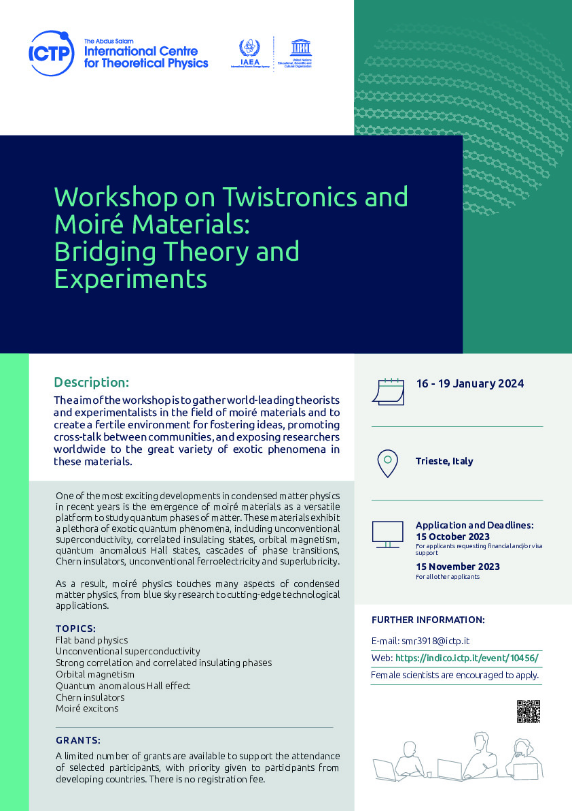
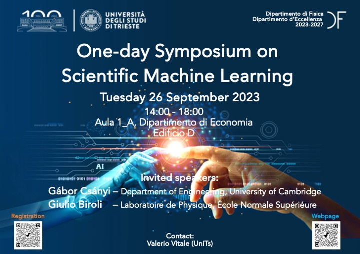
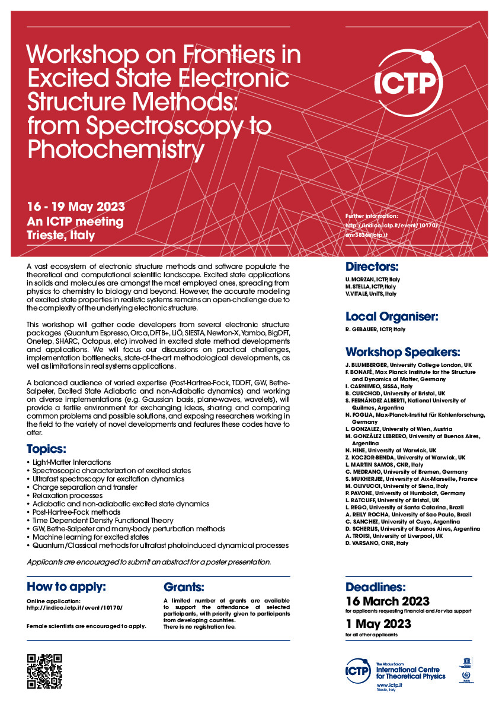

# Workshop on Twistronics and moire' materials: Bridging theory and experiments

Workshop on moire materials, held at the Abdus Salam International Centre for Theoretical Physics (ICTP), Jan 16 - 19 2024, Trieste, Italy [Link to webpage](https://indico.ictp.it/event/10456)

The aim of the workshop was to gather world-leading theorists and experimentalists in the field of moiré materials and to create a fertile environment for fostering ideas, promoting cross-talk between communities, and exposing researchers worldwide to the great variety of exotic phenomena in these materials.
One of the most exciting developments in condensed matter physics in recent years is the emergence of moiré materials as a versatile platform to study quantum phases of matter. These materials exhibit a plethora of exotic quantum phenomena, including unconventional superconductivity, correlated insulating states, orbital magnetism, quantum anomalous Hall states, cascades of phase transitions, Chern insulators, unconventional ferroelectricity and superlubricity.

As a result, moiré physics touches many aspects of condensed matter physics, from blue sky research to cutting-edge technological applications.

**Topics**
- Flat band physics
- Unconventional superconductivity
- Strong correlation and correlated insulating phases
- Orbital magnetism
- Quantum anomalous Hall effect
- Chern insulators
- Moiré excitons

**Speakers**
- E. BASCONES, ICMM-CSIC Madrid, Spain
- B.A. BERNEVIG, Princeton University, USA
- G. CANTELE, CNR, Italy
- S. DE LA BARRERA, University of Toronto, Canada
- M. FABRIZIO, SISSA, Italy
- V. FALKO, University of Manchester, UK
- D. GUERCI, Flatiron Institute, USA
- F. GUINEA LOPEZ, IMDEA Nanociencia, Spain
- A. IMAMOGLU, ETH Zurich, Switzerland
- E. KAXIRAS, Harvard University, USA
- D. KENNES, Max Planck Institute for the Structure and Dynamics of Matter, Germany
- F. KOPPENS, ICFO, Barcelona, Spain
- J. LADO, Aalto University, Finland
- A. LUICAN-MAYER, University of Ottawa, Canada
- S. NADJ-PERGE, California Institute of Technology, USA
- A. ROSSI, IIT Pisa, Italy
- O. VAFEK, Florida State University, USA
- F. WANG, University of California Berkeley, USA
- A. YAZDANI, Princeton University, USA

   

# One-day symposium on scientific machine learning

Symposium on scientific machine learning, held at the University of Trieste, Sep. 26 2023 [Link to webpage](https://df.units.it/it/eventi/62716)

The symposium focused on cutting edge applications of machine learning techniques in physics, but also in other scientific fields such as chemistry and biology. It will feature two seminars by internationally renowned speakers and contributed talks by young and early career researchers from Trieste research institutions.

**Invited Speakers**
- Gábor Csányi, University of Cambridge, UK
- Giulio Biroli, École Normale Supérieure, Paris

   

# Workshop on on Frontiers in Excited State Electronic Structure Methods: from Spectroscopy to Photochemistry

Workshop on excited state methods, held at the Abdus Salam International Centre for Theoretical Physics (ICTP), May 16 - 19 2023, Trieste, Italy

This workshop will gather code developers from several electronic structure packages  (Quantum Espresso, Orca, DFTB+, LiÔ, SIESTA, Newton-X, Yambo, BigDFT, Onetep, SHARC, Octopus, etc) involved in excited state method developments and applications. We will focus our discussions on practical challenges, implementation bottlenecks, state-of-the-art methodological developments, as well as limitations in real systems applications. 

**Topics**
- Light-Matter Interactions
- Spectroscopic characterization of excited states
- Ultrafast spectroscopy for excitation dynamics
- Charge separation and transfer
- Relaxation processes
- Adiabatic and non-adiabatic excited state dynamics
- Post-Hartree-Fock methods
- Time Dependent Density Functional Theory
- GW, Bethe-Salpeter and many-body perturbation methods
- Machine learning for excited states
- Quantum/Classical methods for ultrafast photoinduced dynamical processes

**Speakers**
- J. BLUMBERGER, University College London, UK
- F. BONAFÉ, Max Planck Institute for the Structure and Dynamics of Matter, Germany
- I. CARNIMEO, SISSA, Italy
- B. CURCHOD, University of Bristol, UK
- S. FERNÁNDEZ ALBERTI, National University of Quilmes, Argentina
- N. FOGLIA, Max-Planck-Institut für Kohlenforschung, Germany
- L. GONZALEZ, University of Wien, Austria
- M. GONZÁLEZ LEBRERO, University of Buenos Aires, Argentina
- N. HINE, University of Warwick, UK
- Z. KOCZOR-BENDA, University of Warwick, UK
- L. MARTIN SAMOS, CNR, Italy
- C. MEDRANO, University of Bremen, Germany
- S. MUKHERJEE, University of Aix-Marseille, France
- M. OLIVUCCI, University of Siena, Italy
- P. PAVONE, University of Humboldt, Germany
- L. RATCLIFF, University of Bristol, UK
- L. REGO, University of Santa Catarina, Brazil
- A. REILY ROCHA, University of Sao Paulo, Brazil
- C. SANCHEZ, University of Cuyo, Argentina
- D. SCHERLIS, University of Buenos Aires, Argentina
- A. TROISI, University of Liverpool, UK
- D. VARSANO, CNR, Italy

   

[Link to webpage](https://indico.ictp.it/event/10170/)
